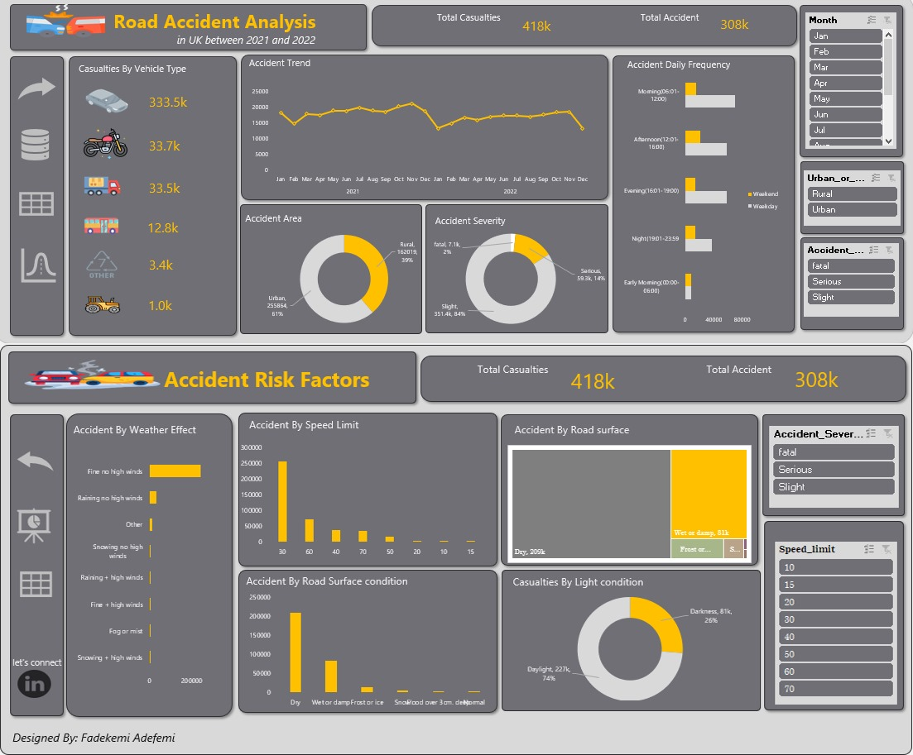

## ABOUT ME

Hello! I'm Fadekemi Adefemi, a Data Analyst passionate about turning numbers into meaningful insights. I enjoy exploring data, spotting patterns, and helping teams make smarter, more informed decisions. I have developed a strong foundation in data analytics and visualization. My experience includes working on projects that involve creating dashboards, generating reports, and analyzing trends that matter to stakeholders. I’m a curious problem-solver with a fast learning curve and a strong interest in business intelligence and analytics. I am excited to keep making impact in this field especially as part of a collaborative team

## TECHNICAL SKILLS
Technical Skills:
Data Analysis & Visualization: Power BI, Tableau, Excel, DAX  
Databases: SQL (Microsoft SQL Server, MySQL, PostgreSQL)  
Programming: Python (Pandas, NumPy, Matplotlib, Seaborn)  

## SOFT SKILLS
Excellent written and verbal communication skills

Problem solving

Critical thinking skills

Attention to detail, among many others

## MY PROJECT 

*A glimpse of some of the projects I've been working on.*

### Road Accident Analysis

This project aims to analyse the road accidents in United Kingdom between the year 2021 and 2022, it evaluates the frequency and severity of the accidents, the number of casualties involved, the factors contributing to the accidents and possible recommendations to minimize the occurrence of accident going forward.

[Read More](https://github.com/Fadekemi29/Road-Accident-Dashboard)

<a href="https://drive.google.com/drive/folders/13b7R1UFki6zKIr5rlA9zAoxrHBet5Cnr?usp=sharing
">Download Project Here</a>

### SKIN CANCER ANALYSIS

**Project 3. **

<a href="upload .pdf">Download the Report here (pdf file)</a>

## CONTACT DETAILS

*Let’s connect and see how we can make a difference together!*

📧 fadekemiadefemi22@gmail.com  

📞 (44) 741-3889-833

📍 Wigan, United Kingdom

⬇️ https://Fadekemi29.github.io/portfolio

🌐 https://linkedin.com/in/Fadekemi01
